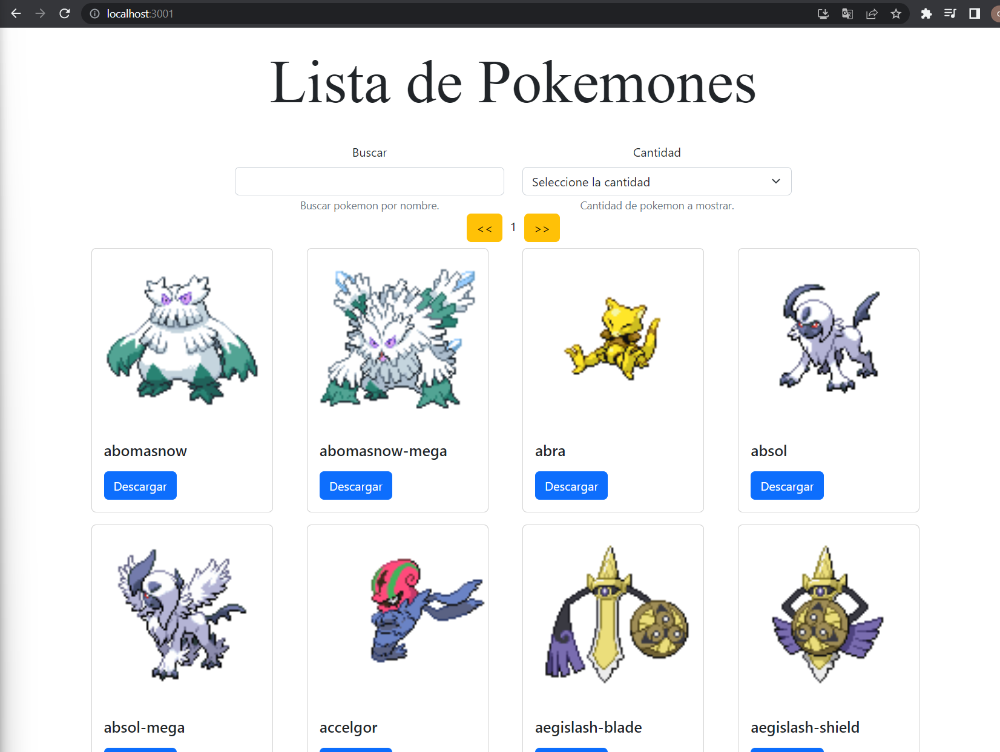
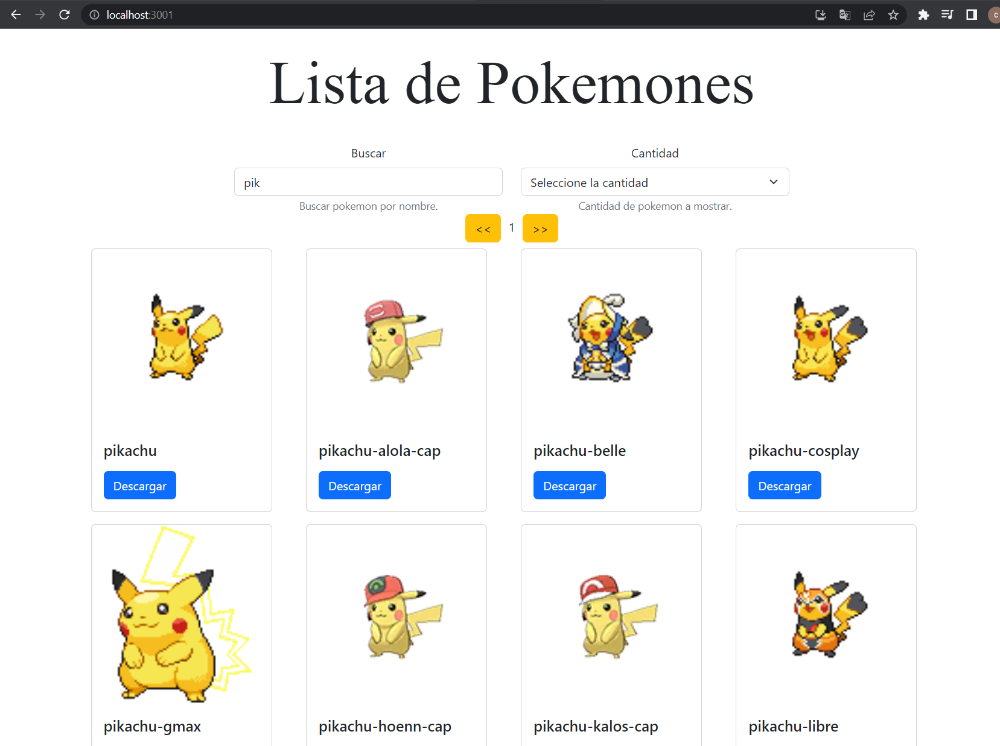
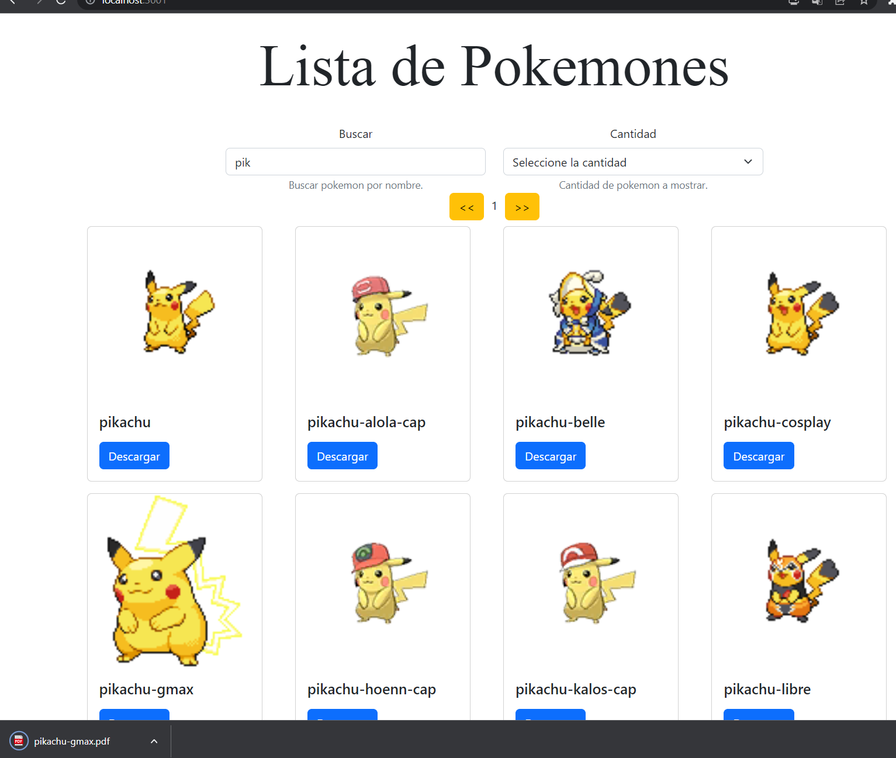

# Proyecto de React JS para consumir servicios en Node JS con Express

Este proyecto utiliza React JS para consumir unos servicios realizados en Node JS con Express. A continuación, se detallan los pasos para instalar y ejecutar el proyecto.

## Instalación

Para ejecutar este proyecto es necesario tener instalado Node JS en tu computadora. Si no lo tienes, puedes descargarlo desde su [sitio oficial](https://nodejs.org/es/).

Una vez instalado Node JS, puedes clonar este repositorio en tu computadora o descargarlo como archivo ZIP.

Luego, desde la carpeta del proyecto, debes abrir una terminal y ejecutar el siguiente comando para instalar las dependencias necesarias:

   ``` npm install ```

   ## Ejecución

Para correr el proyecto, debes ejecutar el siguiente comando desde la carpeta del proyecto:

``` npm start ```

Esto iniciará la aplicación en [http://localhost:3001](http://localhost:3001). Si todo está correctamente configurado, podrás visualizar la página en tu navegador.

## Ejemplos

A continuación, se muestran algunas imágenes de ejemplo de la aplicación.


<br><br>

<br><br>
